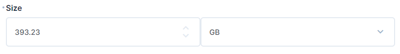

# Directus File Size Interface

This is a Directus extension that adds a file size field type to Directus interface.

## Installation

1. Create a new folder named `file-size` in the `extensions/interfaces` folder of your Directus project.
2. Copy `index.js` into `file-size` folder.
